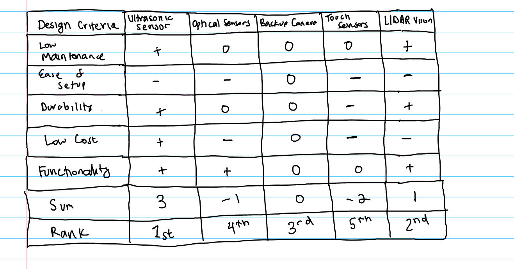
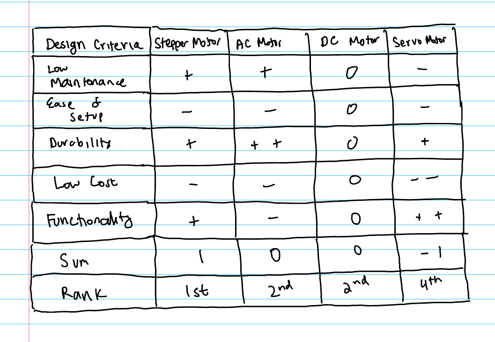
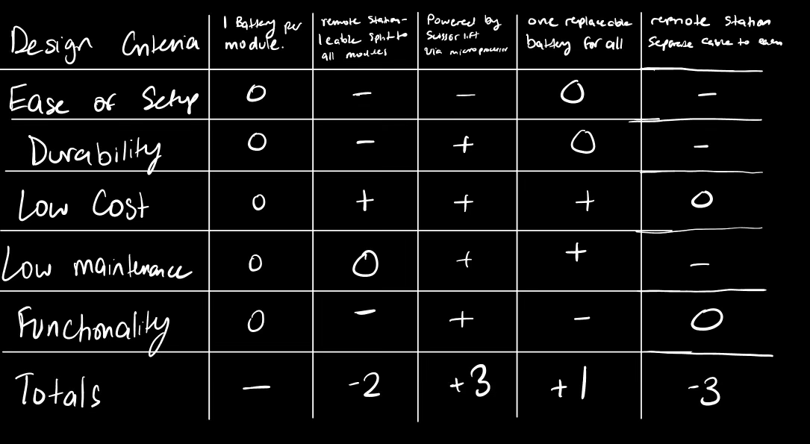
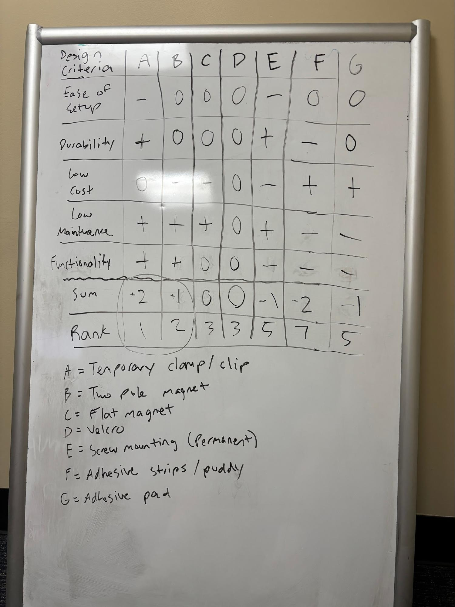

# Technical Memo: Evaluation of Design Solutions — Scissor Lift Collision Prevention System

**Team Name:** Scissor Lift Team 2  
**Members:** Pierson Jones, Jack Oakman, Veer Bhatia, Aaryan Nanekar

---

## Problem Statement and Key Decisions from Selection Process
Scissor lifts can collide with many objects around a given construction site (e.g., door frames, piping, columns). These collisions result in heavy damage, leading to financial burdens, injuries, and fatalities. An object detection device is necessary to alert workers to potential collisions, thereby reducing overall damage and injuries on the construction site.

We generated **4 unique solutions** from over **50 brainstormed ideas** by using screening matrices and a morph chart. The screening matrices, which compared key categories such as sensor types, motor options for the sensors, power sources, and mounting methods, were used to rank each concept against the design criteria. The morph chart then combined the top options—up to four per block—to form the final solution concepts. Out of these solutions, **Solution C** was the most feasible and effective to move forward with in our prototyping process. This solution prioritizes ease of setup, low maintenance, and durability to effectively tackle our client’s problem.

---

## Ideation and Selection Process
We began by decomposing our solution into multiple design blocks: mounting methods, types of sensors, sensor locations, charging/power methods, alerting methods, and types of motors for the sensors. Using the writing-slip method, each member generated 3–10 ideas per block (50+ total).

After initial brainstorming, some ideas were eliminated using common sense and project scope. Next, the team used **four Pugh Screening Matrices** (Appendix Tables 1.1–1.4) to narrow most of the brainstormed ideas. We evaluated mounting methods, sensor types, charging/power methods, and motor types against the design criteria. The most feasible ideas were ranked and selected for a **morph chart** (Appendix Table 2.0).

Using the same design blocks and design criteria, we mixed options in each block to create **4 unique solution ideas**. Some options (e.g., “optical sensors” or “5 sensors on the lift”) were not chosen due to cost or functionality. Others were preferred, such as **ultrasonic sensors** over **LiDAR sensors** and **9 sensors** over **8**, because they scored better in the Pugh matrices. These four solutions were then scored in the **Pugh Scoring Matrix** to select a prototype candidate.

---

## Selected Final Solutions for Evaluation
- **Solution A:** Magnetic mount; 8 sensors (corners); ultrasonic; replaceable batteries; alert with lights; **no motor**  
- **Solution B:** Clamp mount; 9 sensors (corners + basket); **LiDAR**; powered by lift; rapid beeps; **DC servo**  
- **Solution C:** Magnetic mount; 9 sensors (corners + basket); **ultrasonic**; powered by lift; loud beeps; **AC servo**  
- **Solution D:** Clamp mount; 9 sensors (corners + basket); **ultrasonic**; powered by lift; beeps + lights; **stepper**

---

## Pugh Scoring Matrix

| **Design Criteria** | **Weight** | **A Rating** | **A Weightscore** | **B Rating** | **B Weightscore** | **C Rating** | **C Weightscore** | **D Rating** | **D Weightscore** |
|---|:---:|:---:|:---:|:---:|:---:|:---:|:---:|:---:|:---:|
| Ease of Setup   | 25% | 5 | 1.25 | 3 | 0.75 | 4 | 1.00 | 3 | 0.75 |
| Low Maintenance | 30% | 2 | 0.60 | 4 | 1.20 | 5 | 1.50 | 3 | 0.90 |
| Functionality   | 20% | 1 | 0.20 | 4 | 0.80 | 3 | 0.60 | 4 | 0.80 |
| Durability      | 15% | 5 | 0.75 | 2 | 0.30 | 4 | 0.60 | 3 | 0.45 |
| Low Cost        | 10% | 3 | 0.30 | 1 | 0.10 | 3 | 0.30 | 2 | 0.20 |
| **Total Score** | 100% |  | **3.10** |  | **3.15** |  | **4.00** |  | **3.10** |
| **Rank**        | — |  | 3rd (tie) |  | 2nd |  | **1st** |  | 3rd (tie) |
| **Continue**    | — |  | No |  | No |  | **Yes** |  | No |

---

## Relative Weighting for Design Criteria
The design-criteria weighting was selected based on prior rankings. To emphasize easy setup and especially low maintenance, we set **Low Maintenance = 30%** and decreased each successive weight by **5%**, reflecting relative importance without over-penalizing lower-ranked criteria:
- **Low Maintenance:** 30%  
- **Ease of Setup:** 25%  
- **Functionality:** 20%  
- **Durability:** 15%  
- **Low Cost:** 10%

---

## 1–5 Scoring Explained for Each Design Criterion (Appendix Table 3.2)
- **Ease of Setup** — installation time.  
  *1:* > 2 hours · *3:* 30–60 min · *4:* 20–30 min · *5:* < 20 min.
- **Low Maintenance** — monthly service time.  
  *1:* > 6 h/mo · *3:* 1–2 h/mo · *4:* < 1 h/mo · *5:* < 30 min/mo.
- **Functionality** — detection accuracy & reaction speed.  
  *5:* Detect up to 0.5 m; auto-stop < 0.5 s within 0.1 m.
- **Durability** — environmental/physical robustness.  
  *5:* IP65+ and withstands > 1 m drop.
- **Low Cost** — total cost per system.  
  *5:* < \$400 · *1:* > \$1000.

---

## Selected Solution and Justification
- **Components of Solution C:** Magnetic mounting; **9 ultrasonic sensors** (corners and beneath basket); power from lift’s duplex outlet; escalating beeps; **AC servo** for the under-basket sensor.  
- **Why Solution C:**  
  - **Ease of setup:** Two-pole magnets + existing power enable **< 30 min** installs.  
  - **Low maintenance:** **AC servo** offers reliable, consistent performance with less maintenance.  
  - **Durability:** Brushless AC servo with sealed housing; robust magnetic mounting; strong durability score.

---

## Appendix

### Table 1.1: Pugh Screening Matrix 1 for Types of Sensors

### Table 1.2: Pugh Screening Matrix 2 for Types of Motors

### Table 1.3: Pugh Screening Matrix 3 for Powering

### Table 1.4: Pugh Screening Matrix 4 for Mounting Methods

### Table 2.0: Morph Chart

### Table 3.1: Ranked Design Criteria

| **Rank** | **Objectives / Constraints** | **Target Value / Performance Criteria** | **Justification** |
|:--:|---|---|---|
| **1** | Low Maintenance (objective) | ≤ 1 hour/month; automated startup diagnostics | Reduces false security from sensor failure [10]; aligns with OSHA findings on preventable accidents [12]. |
| **2** | Easy Setup (objective) | ≤ 30 minutes install; < 3 steps; basic tools only | Operators often lack advanced technical training [12]; minimizes downtime and increases adoption. |
| **3** | Durability (objective) | IP65+ rating; withstands vibration & 1 m drops; ≥ 3-year lifespan | Construction sites are harsh [7]; durability ensures long-term reliability and cost-effectiveness [18]. |
| **4** | Low Cost (constraint) | ≤ \$500 per lift (full system) | Cheaper than CAT retrofit cameras (\$600–\$800) [8]; avoids repair costs (\$5k–\$15k per incident). |
| **5** | Functionality (objective) | Detect ≥ 0.5 m; stop ≤ 1 s for ~0.1 m | Scissor lifts move at 0.22–1.34 m/s; stopping within 1 s prevents collisions [4]. |

### Table 3.2: Scores for Each Design Criterion Explained

| **Criterion** | **Score 1 (Lowest)** | **Score 2** | **Score 3** | **Score 4** | **Score 5 (Highest)** |
|---|---|---|---|---|---|
| **Ease of Setup** | > 2 hours to install | 1–2 hours | 30–60 minutes | 20–30 minutes | < 20 minutes |
| **Low Maintenance** | > 6 hours/month | 3–5 hours/month | 1–2 hours/month | < 1 hour/month | < 30 minutes/month |
| **Functionality** | Fails a requirement / worse than alternatives | Solves problem but worse than another solution | Detect to 0.5 m; stop 1–2 s within 0.1 m | Detect to 0.5 m; stop 0.5–1 s within 0.1 m | Detect to 0.5 m; stop < 0.5 s within 0.1 m |
| **Durability** | No IP65+ & cannot withstand 1 m drop | No IP65+ & withstands 0.1–<1 m drop | IP65+ & withstands 0.1–<1 m drop | IP65+ & withstands 1 m drop | IP65+ & withstands > 1 m drop |
| **Low Cost** | > \$1000/system | \$700–\$999 | \$500–\$700 | \$400–\$500 | < \$400 |
